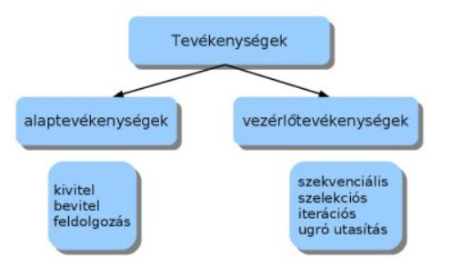
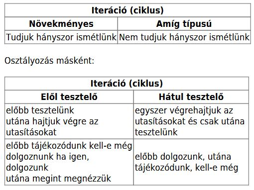
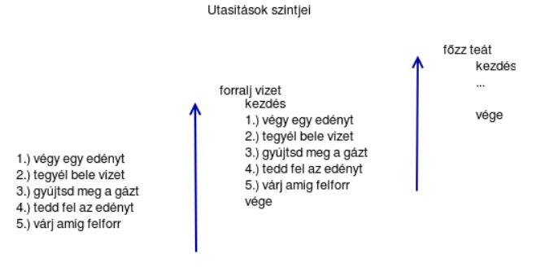
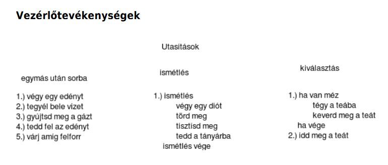
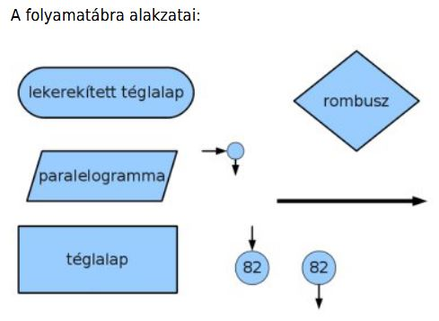
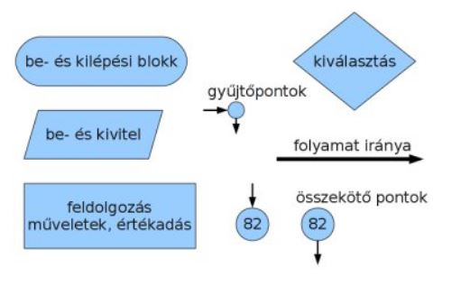
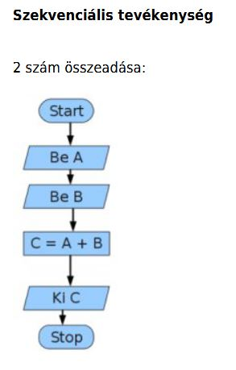
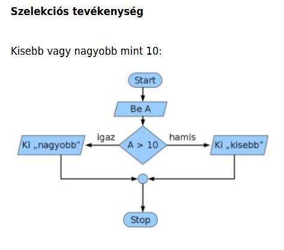
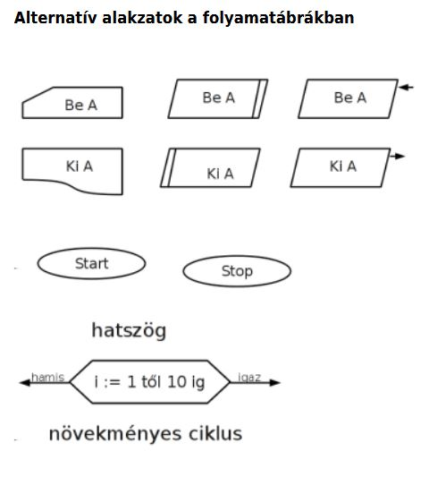

# Programozás elmélet

## A programozás elmélet anyagai

### A programozás 
Napjainkban alig van olyan eszköz, amin ne futna program, az évtizedek során rengeteg új területe jelent meg a programozásnak.

De mi a program?

A program utasításokból áll. A program adatokon dolgozik.

Általánosságban az adatfeldolgozás:
 - adat(ok) beolvasása
 - művelet az adatokkal
 - kivitel (adat megjelenítése)
 - tárolás
 
## A programozás főbb területei

 - asztali alkalmazások fejlesztése (irodai program, játék ....) 
   Általában Windows vagy Linux oprációs rendszerekre íródnak ezek a programok. (Delphi, C#, Java, C++)
   
 - webes alkalmazások fejlesztése 
   A böngészőben fut, független az operációs rendszertől, szinte bármilyen alkalmazás megvalósítható webalkalmazásként.
   Programnyelvek : PHP, Java, C#(asp.net), Javascript ill. Javascript keretrendszerek (Vue, Node.js, React, Angular stb..)
 
 - mobil alkalmazások fejlesztése
   Android, IOS 
   Programnyelvek: Java, Kotlin, C# (Xamarin), egyebek, Swift(IOS)
   
 - adatbázis alkalmazások
   Gyakran valamilyen kiszolgálón, szerveren futnak ezek az alkalmazások, nem ritkán elosztott környezetben.
   
 - játékfejlesztés
   Nemzteközi óriáscégek terepe...
   
 - beágyazott rendszerek,IOT(Internet Of Things)
   PLC, Raspberry Pi, Arduino (C++, Python)
   
## Szerepkörök a szoftverfejlesztésben

 - full stack fejlesztő (minden területen van jártassága)
 - frontend fejlesztő (azok a területeket jelentik, amelyek valamilyen felhasználói felülettel kapcsolatosak)
 - backend fejlesztő (adatkezelés, adatbázisok, az alkalmazások adatokkal való kiszolgálása)
   
  
## Programnyelvekről általában: 

A programnyelvek 3 fő kategóriába sorolhatók:
- gépi nyelv(gépi kód), gyakorlatilag 0-ból és 1-ből álló utasításokról és adatokról van szó
- **assembly** - rendkívül hasonló a gépi kódhoz, csak a bináris kódokat könnyebben megjegyezhető kifejezésekkel helyettesítették.
- **magas szintű nyelvek** a magas szintű nyelvek az ember számára sokkal könnyebben érthetőek, tanulhatóak, használhatóak. A programozók túlnyomó része valamilyen magas szintű nyelven programozik.

Attól függően, hogy a forráskód futtatás előtt lefordításra kerül vagy sem, beszélhetünk interpretált nyelvekről, vagy fordítókról.

**Interpretált nyelvek**: A futtató környezet (interpreter) sorról sorra halad a kód végrehajtásakor.
  PHP, Javascript, Python
  
**Fordítók**: A fordítók a forráskódot valamilyen futtatható tárgykóddá, vagy köztes kóddá fordítják le, majd ezek kerülnek futtatásra.
  C++, Java, C# stb...
   
## Fejlesztői környezetek

olyan szoftverek, amelyek programok írását teszik lehetővé egy(vagy több) adott programnyelven. Ezek a szoftverek fejlett szolgáltatásokkal támogatják a fejlesztő munkáját, pl. kódkiegészítés, szintaktikai kiemelés stb. 
 - MS Visual Studio
 - Visual Studio Code
 - Pycharm
 
## A programfejlsztés lépései általánosságban
- elemzés (analízis)
- tervezés
- kódolás
- tesztelés
- dokumentálás
- terjesztés
- karbantartás

Amennyiben a program sikeres tudott lenni, akkor gyűlni fognak a felhasználói visszajelzések, illetve megjelennek az igények új funkciók beillesztésére a programba. Egy ideig a karbantartás keretében ezekkel a funkciókkal bővíthető lesz a program. Amikor az igényelt új funkciók mennyisége elér egy szintet, akkor új verzió, változat készül a programból. Ezt nevezik a szofver életciklusának.

## Elemzési szakasz
Az elemzési szakaszban felmérjük a helyzetet. Megnézzük modellezhető-e a probléma számítógépen.Ha igen, milyen eszközök alkalmasak a megoldásra. Milyen adatok vannak? Milyen folyamatokat kell modellezni?

 - Bemenő adatok
     - típusok
     - mennyiségek
     - bevitel befejezése
     - feltételek
     - adatok közötti kapcsolatok
 - Kimenő adatok
     - típus
     - megjelenítendő
     - tárolandó
     
## A tervezési szakaszról
A tervezési szakaszban fokozatosan elemeire bontjuk a problémát, meghatározzuk a megoldásalgoritmusát.Egy feladatot több kisebb egységre osztunk fel. Maximálisan annyi egységre osztjuk fel amit mégképesek vagyunk átlátni. Van aki ezt maximálisan 7 egységben adja meg, van aki 30. Maximálisan 10egységre való felbontást ajánlom. A felbontott egységeket újabb egységekre bonthatjuk.Eldöntjük milyen programozási nyelvet választunk.

A fejlesztés során valamilyen ún. módszertant használnak a fejlesztéshez.
A leginkább elterjedtek:
- Scrum
- agilis módszertan
- SSADM


## Algoritmusok

Az algoritmus egyértelműen előírt módon és sorrendben végrehajtandó tevékenységek véges sorozata. Az algoritmusról tehát elmondhatjuk, hogy véges számú lépesben kell végrehajtani. Kapunk valamilyen eredményt. Az egyes lépések egyértelműek. Azonos jellegű feladatokra is használható. Determinisztikus, vagyis ugyanazokra a bemenő adatokra, ugyanazokat a kimenő adatokat kapjuk. A programok algoritmusokból állnak. Az algoritmusok tulajdonképpen matematikai minták.

Az algoritmus tehát olyan instrukciók sorozata, amelyek segítségével egy probléma megoldható.
Az algoritmusok 3 elemből állhatnak:

 - tevékenység (szekvencia)
 - ismételt tevékenységek (ciklusok, iterációk)
   - elöltesztelő, hátultesztelő, növekményes
 - elágazás, esetszétválasztás (szelekció)
   - egyszeres, többszörös
  
 
  
A szekvenciális tevékenység, az amikor a egymás után vesszük lépéseket.A szelekciós tevékenység estén bizonyos utasítások végrehajtását feltételhez kötjük. Ha feltétel teljesül, akkor végrehajtjuk az utasítás halmazt, ha nem akkor nem csinálunk semmit, vagy egymásik utasításhalmazt hajtunk végre. A szelekciós tevékenységet szokás még „elágazás” vagy„döntés” néven emlegetni.

Az iteráció, másként ciklus vagy ismétlés.Egy adott lépést többször szeretnénk végrehajtani.

### A iterációk osztályozása:



### Az utasítások szintjei


### Vezérlő tevékenységek


 
### Az algoritmusok leírására több módszer is használatos:

 - mondatszerű leírás
 - pszeudokód
 - folyamatábra
 - stuktogram
 - Jackson-ábra

## Mondatszerű leírás

Szövegesen leírjuk az algoritmust.

**Szekvenciális tevékenység**

2 szám összeadása:

```C#
Program indul
Bekérünk egy számot
Bekérünk egy másik számot
Összeadjuk az első és második számot, majd eltároljuk egy harmadik helyen
Kiírjuk a harmadik hely értékét
Program vége
```

**Szelekciós tevékenység**

Kisebb vagy nagyobb mint 10:

```C#
Program indul
Beérünk egy számot
Ha az "A" nagyobb akkor a következőt tesszük:  
	  Kiírjuk: „nagyobb”
ellenkező esetben a következőt tesszük:  
	  Kiírjuk: „kisebb”
Ha vége
Program vége
```

**Iterációs tevékenység**

Összeadás 0 végjelig:  
```C#
Program indul
A legyen egyenlő 1-el
B legyen egyenlő 0-l
ismétlés amíg A nem egyenlő 0-l
	bekérünk A helyre egy új számot
	Az A értékét B-hez adjuk, majd az összeget B-ben tároljuk
ismétlés vége
Kiírjuk B értékét
Program vége
```

**Iterációs tevékenység hátul tesztelve**

Összeadás 0 végjelig:
```C#
Program indul
A legyen egyenlő 1-el
B legyen egyenlő 0-l
csináld
	bekérünk A helyre egy új számot
	Az A értékét B-hez adjuk, majd az összeget B-ben tároljuk
ismétlés amíg A nem egyenlő 0 értékkel
Kiírjuk B értékét
Program vége
```

## Pszeudokód

A pszeudokód a szöveges leíráshoz képest tömörebb.

**Szekvenciális tevékenység**

2 szám összeadása:
```C#
Start
Be A
Be B
C = B + A
Ki C
Stop
```
**Szelekciós tevékenység**

Kisebb vagy nagyobb mint 10:
```C#
Start
Be A
Ha A>10 akkor
	Ki „nagyobb”
ellenben
	Ki „kisebb”
Ha vége
Stop
```
 
 **Iterációs tevékenység**
 
 Összeadás 0 végjelig:
 ```C#
 Start
 A=1
 B=0
 ismétlés (A <> 0)
 	bekér A
 	B=B+A
 ismétlés vége
 Kiír B
 Stop
 ```
 **Iterációs tevékenység hátul tesztelve**
 
 Összeadás 0 végjelig:
 ```C#
 Start
 A=1
 B=0
 csináld
 	bekér A
 	B=B+A
 ismétlés (A <> 0)
 Kiír B
 Stop
 ```
 
 ## Folyamatábra
 
 
 
 **Az alakzatok felhasználása**
 
 
 
 
 
 
 
 
 
## A változó fogalma

Minden program adatokkal dolgozik. A változó a memória egy adott méretű, névvel ellátott része. A program futása során valamilyen típusú értéket tárol (szöveg, szám, logikai érték)

## Műveletek

### Aritmetikai műveletek
|Szimbólum|Művelet|Példa|Analógia|
|:-------:|:-----:|:---:|:------:|
|+|értékek összeadása|x+2| |
|-|kivonás vagy előjel váltása|x-2,-x| |
|\*|szorzás|x\*2| |
|/|osztás|x/2| |
|%|osztás maradéka|x%2| A perc = az idő % 60  |
|++|a változó értékének növelése 1-el|x++| |
|--|a változó értékének csökkentése 1-el|x--| |


### Értékadó műveletek
|Szimbólum|Művelet|Példa|Analógia|
|:-------:|:-----:|:---:|:------:|
|=|x az y változó értékét kapja|x=y| |
|+=|x változó növelése y-nal|x+=y|x=x+y|
|-=|x változó csökkentése y-nal|x-=y|x=x-y|
|\*=|x változó szorzása y-nal|x\*=y|x=x\*y|
|/=|x változó osztása y-nal|x/=y|x=x/y|
|%=|Az x változó y-al történő osztásának a maradéka|x%=y|x=x%y|


### Relációs műveletek
|Szimbólum|Művelet|Példa|
|:-------:|:-----:|:---:|
|==|igaz, ha x egyenlő y|x==y|
|!=|igaz, ha x nem egyenlő y|x!=y|
|<|igaz, ha x kisebb mint y|x<y|
|>|igaz, ha x nagyobb mint y|x>y|
|<=|igaz, ha x egyenlő vagy kisebb mint y|x<=y|
|>=|igaz, ha x egyenlő vagy nagyobb mint y|x>=y|

### Logikai műveletek
|Szimbólum|Művelet|Példa|Magyarázat|
|:-------:|:-----:|:---:|:--------:|
|!|NOT (NEM) (logikai tagadás)|!x|Igaz(1), ha az operandus értéke Hamis(0) ; Hamis(0) ha az operandus értéke nem Hamis(0)|
|\|\||OR (VAGY) (logikai választás)|x < 5 \|\| x > 7|Igaz(1), ha bármelyik feltétel igaz|
|&&|AND (ÉS) (logikai összeadás)|x == 5 &&  y < 7|Igaz(1), ha mindegyik feltétel igaz|

### Logikai műveletek igazságtáblázata

**! Not (tagadás)**
|a|!a|
|:---:|:----:|
|0|1|
|1|0|

**OR (vagy) művelet**
|a|b|a OR B|
|:--:|:--:|:--:|
|0|0|0|
|0|1|1|
|1|0|1|
|1|1|1|

**AND (és) művelet**
|a|b|a AND B|
|:--:|:--:|:--:|
|0|0|0|
|0|1|0|
|1|0|0|
|1|1|1|

**XOR (kizáró vagy) művelet**
|a|b|a XOR B|
|:--:|:--:|:--:|
|0|0|0|
|0|1|1|
|1|0|1|
|1|1|0|

## Algoritmizálás példák

**Telefonálás algoritmusa**
-előveszem a telefont
-bekapcsolom a kijelzőt
-beírom a feloldó kódot
-megkeresem a névjegyek közül azt akit hívni akarok
-megnyomom a hívást
-várok
-ha nem veszi fel, megszakítom a hívást
-egyébként beszélünk
-a beszélgetés végén megszakítom a hívást
-elteszem a telefont

**Teafőzés algoritmusa**
-veszek egy edényt
-megtöltöm vízzel
-felteszem melegedni
-ha felforrt beleteszem a filtert
-ha megfelelő a színe csészébe töltöm
-citromot adok hozzá
-édesítem
-megiszom


