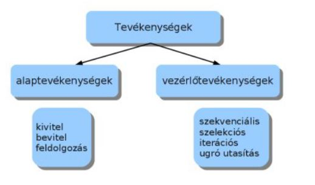
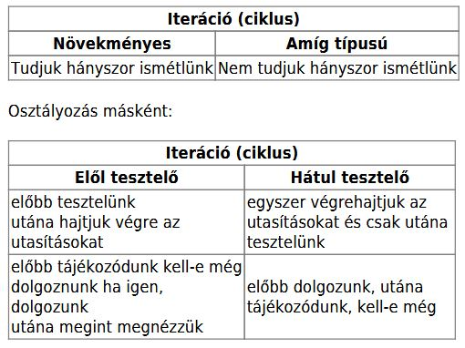
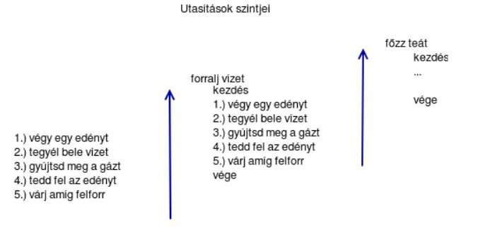
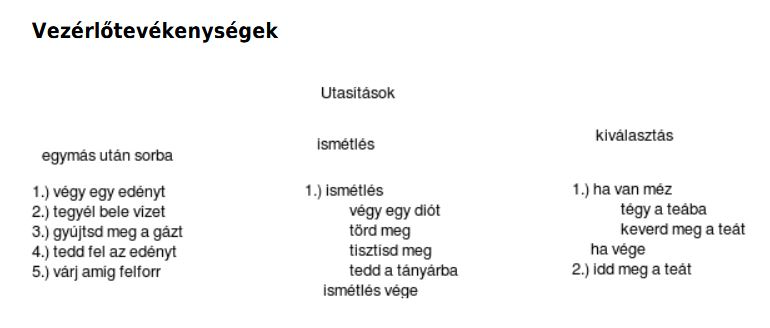
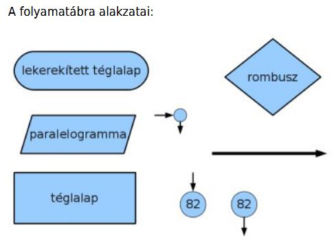
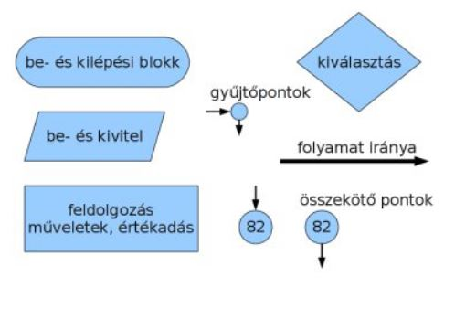
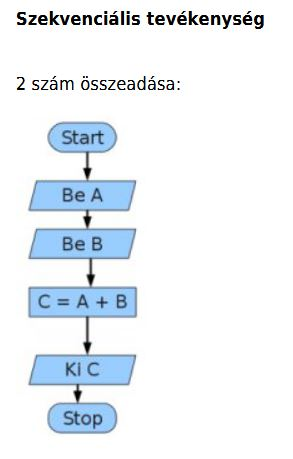
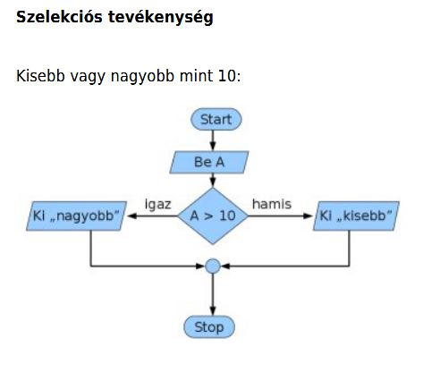
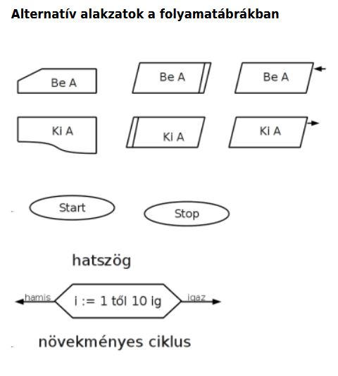

# Programozás elmélet

## A programozás elmélet anyagai

### A programozás 
Napjainkban alig van olyan eszköz, amin ne futna program, az évtizedek során rengeteg új területe jelent meg a programozásnak.

De mi a program?

A program utasításokból áll. A program adatokon dolgozik.

Általánosságban az adatfeldolgozás:
 - adat(ok) beolvasása
 - művelet az adatokkal
 - kivitel (adat megjelenítése)
 - tárolás
 
## A programozás főbb területei

 - asztali alkalmazások fejlesztése (irodai program, játék ....) 
   Általában Windows vagy Linux oprációs rendszerekre íródnak ezek a programok. (Delphi, C#, Java, C++)
   
 - webes alkalmazások fejlesztése 
   A böngészőben fut, független az operációs rendszertől, szinte bármilyen alkalmazás megvalósítható webalkalmazásként.
   Programnyelvek : PHP, Java, C#(asp.net), Javascript ill. Javascript keretrendszerek (Vue, Node.js, React, Angular stb..)
 
 - mobil alkalmazások fejlesztése
   Android, IOS 
   Programnyelvek: Java, Kotlin, C# (Xamarin), egyebek, Swift(IOS)
   
 - adatbázis alkalmazások
   Gyakran valamilyen kiszolgálón, szerveren futnak ezek az alkalmazások, nem ritkán elosztott környezetben.
   
 - játékfejlesztés
   Nemzteközi óriáscégek terepe...
   
 - beágyazott rendszerek,IOT(Internet Of Things)
   PLC, Raspberry Pi, Arduino (C++, Python)
   
## Szerepkörök a szoftverfejlesztésben

 - full stack fejlesztő (minden területen van jártassága)
 - frontend fejlesztő (azok a területeket jelentik, amelyek valamilyen felhasználói felülettel kapcsolatosak)
 - backend fejlesztő (adatkezelés, adatbázisok, az alkalmazások adatokkal való kiszolgálása)
   
  
## Programnyelvekről általában: 

A programnyelvek 3 fő kategóriába sorolhatók:
- gépi nyelv(gépi kód), gyakorlatilag 0-ból és 1-ből álló utasításokról és adatokról van szó
- **assembly** - rendkívül hasonló a gépi kódhoz, csak a bináris kódokat könnyebben megjegyezhető kifejezésekkel helyettesítették.
- **magas szintű nyelvek** a magas szintű nyelvek az ember számára sokkal könnyebben érthetőek, tanulhatóak, használhatóak. A programozók túlnyomó része valamilyen magas szintű nyelven programozik.

Attól függően, hogy a forráskód futtatás előtt lefordításra kerül vagy sem, beszélhetünk interpretált nyelvekről, vagy fordítókról.

**Interpretált nyelvek**: A futtató környezet (interpreter) sorról sorra halad a kód végrehajtásakor.
  PHP, Javascript, Python
  
**Fordítók**: A fordítók a forráskódot valamilyen futtatható tárgykóddá, vagy köztes kóddá fordítják le, majd ezek kerülnek futtatásra.
  C++, Java, C# stb...
   
## Fejlesztői környezetek

olyan szoftverek, amelyek programok írását teszik lehetővé egy(vagy több) adott programnyelven. Ezek a szoftverek fejlett szolgáltatásokkal támogatják a fejlesztő munkáját, pl. kódkiegészítés, szintaktikai kiemelés stb. 
 - MS Visual Studio
 - Visual Studio Code
 - Pycharm
 
## A programfejlsztés lépései általánosságban
- elemzés (analízis)
- tervezés
- kódolás
- tesztelés
- dokumentálás
- terjesztés
- karbantartás

Amennyiben a program sikeres tudott lenni, akkor gyűlni fognak a felhasználói visszajelzések, illetve megjelennek az igények új funkciók beillesztésére a programba. Egy ideig a karbantartás keretében ezekkel a funkciókkal bővíthető lesz a program. Amikor az igényelt új funkciók mennyisége elér egy szintet, akkor új verzió, változat készül a programból. Ezt nevezik a szofver életciklusának.

## Elemzési szakasz
Az elemzési szakaszban felmérjük a helyzetet. Megnézzük modellezhető-e a probléma számítógépen.Ha igen, milyen eszközök alkalmasak a megoldásra. Milyen adatok vannak? Milyen folyamatokat kell modellezni?

 - Bemenő adatok
     - típusok
     - mennyiségek
     - bevitel befejezése
     - feltételek
     - adatok közötti kapcsolatok
 - Kimenő adatok
     - típus
     - megjelenítendő
     - tárolandó
     
## A tervezési szakaszról
A tervezési szakaszban fokozatosan elemeire bontjuk a problémát, meghatározzuk a megoldásalgoritmusát.Egy feladatot több kisebb egységre osztunk fel. Maximálisan annyi egységre osztjuk fel amit mégképesek vagyunk átlátni. Van aki ezt maximálisan 7 egységben adja meg, van aki 30. Maximálisan 10egységre való felbontást ajánlom. A felbontott egységeket újabb egységekre bonthatjuk.Eldöntjük milyen programozási nyelvet választunk.

A fejlesztés során valamilyen ún. módszertant használnak a fejlesztéshez.
A leginkább elterjedtek:
- Scrum
- agilis módszertan
- SSADM


## Algoritmusok

Az algoritmus egyértelműen előírt módon és sorrendben végrehajtandó tevékenységek véges sorozata. Az algoritmusról tehát elmondhatjuk, hogy véges számú lépesben kell végrehajtani. Kapunk valamilyen eredményt. Az egyes lépések egyértelműek. Azonos jellegű feladatokra is használható. Determinisztikus, vagyis ugyanazokra a bemenő adatokra, ugyanazokat a kimenő adatokat kapjuk. A programok algoritmusokból állnak. Az algoritmusok tulajdonképpen matematikai minták.

Az algoritmus tehát olyan instrukciók sorozata, amelyek segítségével egy probléma megoldható.
Az algoritmusok 3 elemből állhatnak:

 - tevékenység (szekvencia)
 - ismételt tevékenységek (ciklusok, iterációk)
   - elöltesztelő, hátultesztelő, növekményes
 - elágazás, esetszétválasztás (szelekció)
   - egyszeres, többszörös
  
 
  
A szekvenciális tevékenység, az amikor a egymás után vesszük lépéseket.A szelekciós tevékenység estén bizonyos utasítások végrehajtását feltételhez kötjük. Ha feltétel teljesül, akkor végrehajtjuk az utasítás halmazt, ha nem akkor nem csinálunk semmit, vagy egymásik utasításhalmazt hajtunk végre. A szelekciós tevékenységet szokás még „elágazás” vagy„döntés” néven emlegetni.

Az iteráció, másként ciklus vagy ismétlés.Egy adott lépést többször szeretnénk végrehajtani.

### A iterációk osztályozása:



### Az utasítások szintjei


### Vezérlő tevékenységek


 
### Az algoritmusok leírására több módszer is használatos:

 - mondatszerű leírás
 - pszeudokód
 - folyamatábra
 - stuktogram
 - Jackson-ábra

## Mondatszerű leírás

Szövegesen leírjuk az algoritmust.

**Szekvenciális tevékenység**

2 szám összeadása:

```C#
Program indul
Bekérünk egy számot
Bekérünk egy másik számot
Összeadjuk az első és második számot, majd eltároljuk egy harmadik helyen
Kiírjuk a harmadik hely értékét
Program vége
```

**Szelekciós tevékenység**

Kisebb vagy nagyobb mint 10:

```C#
Program indul
Beérünk egy számot
Ha az "A" nagyobb akkor a következőt tesszük:  
	  Kiírjuk: „nagyobb”
ellenkező esetben a következőt tesszük:  
	  Kiírjuk: „kisebb”
Ha vége
Program vége
```

**Iterációs tevékenység**

Összeadás 0 végjelig:  
```C#
Program indul
A legyen egyenlő 1-el
B legyen egyenlő 0-l
ismétlés amíg A nem egyenlő 0-l
	bekérünk A helyre egy új számot
	Az A értékét B-hez adjuk, majd az összeget B-ben tároljuk
ismétlés vége
Kiírjuk B értékét
Program vége
```

**Iterációs tevékenység hátul tesztelve**

Összeadás 0 végjelig:
```C#
Program indul
A legyen egyenlő 1-el
B legyen egyenlő 0-l
csináld
	bekérünk A helyre egy új számot
	Az A értékét B-hez adjuk, majd az összeget B-ben tároljuk
ismétlés amíg A nem egyenlő 0 értékkel
Kiírjuk B értékét
Program vége
```

## Pszeudokód

A pszeudokód a szöveges leíráshoz képest tömörebb.

**Szekvenciális tevékenység**

2 szám összeadása:
```C#
Start
Be A
Be B
C = B + A
Ki C
Stop
```
**Szelekciós tevékenység**

Kisebb vagy nagyobb mint 10:
```C#
Start
Be A
Ha A>10 akkor
	Ki „nagyobb”
ellenben
	Ki „kisebb”
Ha vége
Stop
```
 
 **Iterációs tevékenység**
 
 Összeadás 0 végjelig:
 ```C#
 Start
 A=1
 B=0
 ismétlés (A <> 0)
 	bekér A
 	B=B+A
 ismétlés vége
 Kiír B
 Stop
 ```
 **Iterációs tevékenység hátul tesztelve**
 
 Összeadás 0 végjelig:
 ```C#
 Start
 A=1
 B=0
 csináld
 	bekér A
 	B=B+A
 ismétlés (A <> 0)
 Kiír B
 Stop
 ```
 
 ## Folyamatábra
 
 
 
 **Az alakzatok felhasználása**
 
 
 
 
 
 
 
 
 
## A változó fogalma

Minden program adatokkal dolgozik. A változó a memória egy adott méretű, névvel ellátott része. A program futása során valamilyen típusú értéket tárol (szöveg, szám, logikai érték)

## Műveletek

### Aritmetikai műveletek
|Szimbólum|Művelet|Példa|Analógia|
|:-------:|:-----:|:---:|:------:|
|+|értékek összeadása|x+2| |
|-|kivonás vagy előjel váltása|x-2,-x| |
|\*|szorzás|x\*2| |
|/|osztás|x/2| |
|%|osztás maradéka|x%2| A perc = az idő % 60  |
|++|a változó értékének növelése 1-el|x++| |
|--|a változó értékének csökkentése 1-el|x--| |

**A változó értékének növelése 1-el két módon is történhet**

**x++** - a változó értékének növelése 1-el
**++x** - a változó értékének növelése 1-el

**Mi a különbség?**
Akkor van jelentősége, ha az értéknövelés valamilyen értékadásban szerepel.
**x++** esetén először használjuk az **x** értékét, majd csak utána növeljük.
**++x** esetén először növeljük **x** értékét, majd utána használjuk fel az értéket.
```c#
x=3
y=x++
```
**y** értéke 3 a fenti két utasítás után.

```c#
x=3
y=++x
```
**y** értéke 4 a fenti két utasítás után.

### Értékadó műveletek
|Szimbólum|Művelet|Példa|Analógia|
|:-------:|:-----:|:---:|:------:|
|=|x az y változó értékét kapja|x=y| |
|+=|x változó növelése y-nal|x+=y|x=x+y|
|-=|x változó csökkentése y-nal|x-=y|x=x-y|
|\*=|x változó szorzása y-nal|x\*=y|x=x\*y|
|/=|x változó osztása y-nal|x/=y|x=x/y|
|%=|Az x változó y-al történő osztásának a maradéka|x%=y|x=x%y|


### Relációs műveletek
|Szimbólum|Művelet|Példa|
|:-------:|:-----:|:---:|
|==|igaz, ha x egyenlő y|x==y|
|!=|igaz, ha x nem egyenlő y|x!=y|
|<|igaz, ha x kisebb mint y|x<y|
|>|igaz, ha x nagyobb mint y|x>y|
|<=|igaz, ha x egyenlő vagy kisebb mint y|x<=y|
|>=|igaz, ha x egyenlő vagy nagyobb mint y|x>=y|

### Logikai műveletek
|Szimbólum|Művelet|Példa|Magyarázat|
|:-------:|:-----:|:---:|:--------:|
|!|NOT (NEM) (logikai tagadás)|!x|Igaz(1), ha az operandus értéke Hamis(0) ; Hamis(0) ha az operandus értéke nem Hamis(0)|
|\|\||OR (VAGY) (logikai választás)|x < 5 \|\| x > 7|Igaz(1), ha bármelyik feltétel igaz|
|&&|AND (ÉS) (logikai összeadás)|x == 5 &&  y < 7|Igaz(1), ha mindegyik feltétel igaz|

### Logikai műveletek igazságtáblázata

**! Not (tagadás)**
|a|!a|
|:---:|:----:|
|0|1|
|1|0|

**OR (vagy) művelet**
|a|b|a OR B|
|:--:|:--:|:--:|
|0|0|0|
|0|1|1|
|1|0|1|
|1|1|1|

**AND (és) művelet**
|a|b|a AND B|
|:--:|:--:|:--:|
|0|0|0|
|0|1|0|
|1|0|0|
|1|1|1|

**XOR (kizáró vagy) művelet**
|a|b|a XOR B|
|:--:|:--:|:--:|
|0|0|0|
|0|1|1|
|1|0|1|
|1|1|0|

## Algoritmizálás példák

**Telefonálás algoritmusa**

 - előveszem a telefont
 - bekapcsolom a kijelzőt
 - beírom a feloldó kódot
 - megkeresem a névjegyek közül azt akit hívni akarok
 - megnyomom a hívást
 - várok
 - ha nem veszi fel, megszakítom a hívást
 - egyébként beszélünk
 - a beszélgetés végén megszakítom a hívást
 - elteszem a telefont

**Telefonálás algoritmus finomítása**
- előveszem a telefont -> tevékenység
- bekapcsolom a kijelzőt -> tevékenység
- beírom a feloldó kódot -> ismételt tevékenység (milyen ciklus?)
- megkeresem aki hívni akarok
	- belépés a névjegyek közé (tevékenység)
	- keresés amíg meg nem találom akit hívni akarok (ciklus)
- hívás (tevékenység)
- várok (cseng)  ->tevékenység
- ha felveszi a hívott a telefont akkor beszélünk
	egyébként megszakítom a hívást -> elágazás
- elteszem a telefon ->tevékenység	

**Telefonálás algoritmus szöveges leírása**
```c#
Program indul
Telefon elővesz
Kijelző bekapcsolás
Feloldó kód beírás
Ciklus amíg rossz a feloldó kód
	Feloldó kód beírás
Ciklus vége
Belépés a névjegyekbe
Ciklus amíg meg nem találom akit hívni akarok
	Névjegy keresése
Ciklus vége
Hívás indítása
Várakozás
Ha hívott fél felveszi
  akkor
    beszélgetés
  egyébként
    hívás megszakítása
Ha vége
Telefon eltesz
Program vége	  
```

**Teafőzés algoritmusa**

 - veszek egy edényt
 - megtöltöm vízzel
 - felteszem melegedni
 - ha felforrt beleteszem a filtert
 - ha megfelelő a színe csészébe töltöm
 - citromot adok hozzá
 - édesítem
 - megiszom
 
 **Teafőzés algoritmusának finomítása
 - veszek egy edényt -> tevékenység (ciklus is lehet)
 - megtöltöm vízzel -> tevékenység (ciklus is lehet)
 - felteszem melegedni -> ciklus !
 - belteszem a filtert ->tevékenység
 - ha megfelelő a színe csészébe töltöm -> ciklus
 - citromot adok hozzá -> tevékenység
 - édesítem -> tevékenység
 - megiszom -> tevékenység

### Algoritmizálási feladatok

- Kérjen be két számot, szorozza össze a számokat, írja az eredményt a képernyőre. 
- Kérjen be két számot, a nagyobbat ossza el a kisebbel, az eredményt írja a képernyőre. 
- Kérjen be két számot, majd írassa a nagyobbat a képernyőre. 
- Kérjen be két számot, a nagyobbat ossza el kettővel, a kisebbet hárommal. Az eredményt írja a képernyőre. 
- Kérjen be számokat 0 végjelig. Számolja meg az 5-nél nagyobb számokat. Írassa a képernyőre hány 5-nél nagyobb számot írt be a felhasználó. 
- Kérjen be folyamatosan hőmérséklet adatokat. Ha a beírt hőmérséklet fagypont alá esik, akkor ne kérjen többet. 
- Kérjen be folyamatosan hőmérséklet adatokat. Ha a beírt hőmérséklet -5 fok alá esik, akkor ne kérjen többet. Írassa ki, hány hőmérsékletadatot adott meg felhasználó. 
- Kérjen be 0 végjelig számokat. Írassa ki hány darab számot írt be a felhasználó. 
- Kérjen be 0 végjelig számokat. A bekért számokat adja össze. Az eredmény írja a képernyőre. 
- Kérjen be 0 végjelig számokat. A bekért számokat szorozza össze. Az eredményt írja a képernyőre. 

**Adott a következő leírás**
```py
Start
a = 3
b = 5
c = 1
d = 0
Ha b < 5 akkor
  d = 8
  c = 5 + a
ellenben
  d = 15
Ha vége
Ha c < d akkor
  d = 40
Ha vége
Vége
```
**Mi lesz d értéke a program végén?**

**Adott a következő szöveges leírása egy programnak:**
```py
Start
a = 45
b = 37
c = a - b
d = 3
f = 2
g = b * a
a = g
ha a > f akkor
    b = 23
ellenben
    c = 23
ha vége
ha b == c akkor
    b = 4
ellenben
    d = 4
ha vége
Stop
```
**A program végén mi lesz a,b,c,d értéke?**

## Lottó játék algoritmusa
A játék induláskor kérje be a felhasználótól azt, hogy hány számmal akar játszani, illetve hány számból akarja sorsoltatni a nyerőszámokat. A klasszikus ötös lottó esetében 90 szám közül lehet 5-öt választani.
Az induló adatok után a program kérje be a felhasználótól a megadott számú tippeket. Nem lehet két egyforma tipp, valamint a tippeknek a megadott számtartományba kell esniük.
Sorsoláskor figyelni kell arra, hogy nem lehet egyforma nyerőszám.
A játék végén meg kell határozni, hogy a játékos hány számot talált el.

### Mondatszerű leírás
```py
Be hanySzam
Be osszSzam
Növekményes ciklus i=1-től 5-ig
	Be atmeneti
	Ciklus amíg (atmeneti<1 vagy atmeneti>osszSzam vagy atmeneti in tippek)
		Ki "Rossz tipp, újra!"
		Be atmeneti
	tippek.betesz(atmeneti)	
```
## Függvények, alprogramok
Az angol **function** szóból ered a függvény elnevezés, azonban a programozásban a függvény némileg mást jelent, mint a matematikában.

**Matematikai függvények:** négyzet, négyzetgyök stb.

**Függvény a programozásban**: vagy végrehajt tevékenységeket, vagy valamilyen művelet eredményét szolgáltatja.

**Mire valók ezek a függvények/alprogramok?**
 - valameilyen érték kiszámítására, majd annak átadására
 - gyakran ismétlődő tevékenységek végrehajtására
 
 ### Alprogramok Python-ban
 Adott tevékenységeket végrehajtó alprogramok:
 
 Ez az alprogram pusztán annyit tud, hogy a beleírt szövegeket ki tudja írni. Nem rendelkezik semmilyen bemenő értékkel(argumentummal).
 ```py
 def kiir():
    print("Hello,")
    print("ez egy alprogram")
 ```
Ennek az alprogramnak a végrehajtása (meg kell hívni a program egy adott pontján ahhoz, hogy működjön):
```py
kiir()
```


Ez az alprogram már többet tud, mert át tudjuk adni neki azt a szöveget, amit ki akarunk íratni (van argumentum, mégpedig a ***szoveg***):
Az argumentum nem más, mint egy változó.

```py
def masikKiir(szoveg):
    print(szoveg)
```    

Ennek az alprogramnak a meghívása:
```py
masikKiir("Hello")
masikKiir("Mizu?")
```
### Visszatérési értékkel rendelkező függvények/alprogramok
Ezek az alprogramok mindig tartalmaznak egy **return** utasítást, a return után szerepel az a változó, vagy kifejezés, amelyet az alprogram visszaad.
A visszatérési értékkel rendelkező alprogramok szerepelhetnek értékadás jobb oldalán, vagy valamilyen kifejezésben.

**Összeadást végző alprogram**

Deklarálás:
```py
def osszeg(a,b,c):
    return a+b+c    
```

Használat a program egy adott pontján:
```py
c=osszeg(100,200,300)
print(osszeg(100,200,300))
```

Feladat:
 Írjon alprogramot, amely kap 3 szöveget, és ezeket a szövegeket egymással összefűzve kiírja!
 
 ## Alapvető algoritmusok (progamozási tételek)
 
  - kiválogatás
  - megszámlálás
  - összegzés
  - minimum meghatározása
  - maximum meghatározás
  - rendezés
  
  ### Kiválogatás,keresés
  
  ```py
  Start
  Ciklus i=0 tól hossz(adatszerkezet)
  	adatszerkezet.hozzáad(adat)
  Ciklus vége	
  Ciklus i=0 tól hossz(adatszerkezet)
  	ha (adatszerkezet[i]==keresett elem)
		eredmenyek.hozzáad(adatszerkezet[i])
  Ciklus vége		
  Ki: eredmenyek			
  Stop
  ```
 ### Megszámlálás, összegzés
 
 ```py
 Start
 darabszám=0
 Ciklus i=0 tól hossz(adatszerkezet)
 	ha (adatszerkezet[i]==feltétel)
		darabszám=darabszám+1
Ciklus vége		
Ki:darabszám
Stop
 ```
 **Összes elem összeadása**
 ```py
 Start
 összeg=0
 Ciklus i=0 tól hossz(adatszerkezet)
 	összeg=összeg+adatszerkezet[i]
 Ciklus vége	
 Ki összeg	
 Stop
 ```
 **Adott feltételnek megfelelő elemek összeadása**

```py
Start
összeg=0
Ciklus i=0 tól hossz(adatszerkezet)
	ha(adatszerkezet[i]==feltétel)
		összeg=összeg+adatszerkezet[i]
Ciklus vége		
Ki összeg		
Stop
```
**Minimum meghatározása**

```py
Start
Adatszerkezet feltöltése
min=adatszerkezet[0]
Ciklus i=0 tól hossz(adatszerkezet)
 	ha(adatszerkezet[i]<min
		min=adatszerkezet[i]
Ciklus vége
Ki min
Stop
```

**Maximum meghatározása**

```py
Start
Adatszerkezet feltöltése
max=adatszerkezet[0]
Ciklus i=0 tól hossz(adatszerkezet)
 	ha(adatszerkezet[i]>max)
		max=adatszerkezet[i]
Ciklus vége
Ki max
Stop
```

```py
szamok=[10,67,6,5,1]

for i in range(0,len(szamok)-1):
  for j in range(i+1,len(szamok)):
      if(szamok[i]>szamok[j]):
        temp=szamok[i]
        szamok[i]=szamok[j]
        szamok[j]=temp

print(szamok)        
```
## Lambda kifejezések

A lambda kifejezések segítségével egyszerű függvényeket gyorsabban lehet létrehozni.

```py
def hozzaad(a):
	return a+10	
```
**Használata:**
```py
hozzaad(100)
```
**Ugyanez lambda kifejezéssel:**

```py
hozzaad=lambda a:a+10
```
**Használata:**

```py
hozzaad(10)
```
**Több paraméter is használható egy lambda kifejezésben**

```py
osztas=lambda a,b:a/b
print(osztas(20,5)
```

## Objektum-orientált programozás és szemlélet, osztályok

Hagyományos programozás: A feladatok megoldása tevékenységekkel, elágazásokkal, ciklusokkal, valamint alprogramokkal. 

Szoftver krízis: a programok bonyolultsága átlépett egy határt, ezeket a feladatokat már nem lehetett a hagyományos programozás módszereivel hatékonyan megoldani, új szemléletre volt szükség.

Objektum-orientált szemlélet: a programok egymással kapcsolatban lévő objektumokból (ablak, menü, eseményvezérlés stb). állnak. 

Az OOP szemlélet alapja az osztály(class). Az osztály egy összetett struktúra, tartalmaz adatokat (adattag) és metódusokat (a metódus ugyanaz mint a függvény).
Az osztály metódusai gyakorlatilag azokat a tevékenységeket jelentik, amit az osztály "meg tud csinálni". Önálló egység, saját adatokkal és tevékenységekkel. 
Az osztály adatainak és metódusainak láthatósága szabályozható. 

### Példa osztály használatára

Létrehozunk egy **Szemely** nevű osztályt. Az osztálynak vannak adattagjai (ezek gyakorlatilag változók) és lehetnek metódusai(azaz alprogramjai), de nem
kötelező, hogy legyenek alprogramok kivéve az adattagok kezdeti beállításáért felelős konstruktor függvényt. A konstruktor az osztály példányosításakor automatikusan lefut. Python-ban az __init__ a konstruktor. A self az osztály azonosító paramétere, azonosítja az osztály alapján létrehozott példányt.
A self után jönnek azok a paraméterek, amelyek használatával az adattagok beállíthatóak. Az adattagok előtt mindig szerepel a self azonosító.

```py
class Szemely:
    def __init__(self,nev,szuletesiEv):
        self.nev=nev
        self.szuletesiEv=szuletesiEv
```
Az osztály alapján példányokat tudunk létrehozni a programban, ez a példányosítás művelete.
```py
szemely1=Szemely("Ubul",1998)
szemely2=Szemely("Zénó",2001)
```
A szemely1 ill. a szemely2 a Szemely osztály **példányai**. A programban a példányokat tudjuk használni, a példányok egymástól függetlenek.

Az osztály nem csak adatok tárolására jó, hanem alprogramokat is tartalmazhat, amelyeket végre tudunk hajtatni.
Oldjuk meg, hogy az osztály kiírja a nev adattag értékét!
```py
class Szemely:
    def __init__(self,nev,szuletesiEv):
        self.nev=nev
        self.szuletesiEv=szuletesiEv

    def Bemutatkozas(self):
        print("Jó napot "+self.nev+" vagyok.")
```
Az osztály alprogramját a következőképpen tudjuk végrehajtatni:
```py
szemely1.Bemutatkozas()
```
## Kivételek, kivételek kezelés

A kivétel akkor jelentkezik, amikor valamilyen probléma lép fel a program futása során. A futtató környezet önmagában nem tudja ezeket a problémákat megoldani, ezért ha az adott kivételt nem kezelük, a program futása leáll, a program kilép. A potenciális kivételek kezelése a programozó feladata, ha a keletkező kivételeket megfelelően kezeli, hibák esetén sem lép ki majd a program.

A kivételek kezelésére Pythonban a try..except  (más nyelvekben pl. try..catch) blokkban kerül sor.
A try blokkba kerülnek azok az utasítások, amelyek futása során kivétel jöhet létre. Amennyiben kivétel keletkezik valamelyik utasítás végrehajtásakor, akkor a soron következő utasítás a try blokkban már nem fog végrehajtódni, hanem a vezérlés átkerül az except blokkba. Az except blokkban lévő utasítások végrehajtásával lehet a felmerült problémát kezelni. Ez lehet egy hibaüzenet, ismételt adatbekérés stb. 

A try..except blokkot kiegészíthetjük egy finally blokkal, de ez nem kötelező. A finally blokkba írt utasítások mindenféleképpen le fognak futni.

Több except blokk is használható, amennyiben mi a különböző kivételekre eltérően akarunk reagálni. Pl. ValueError esetén a változó értéke nem megfelelő, pl. szám helyett szöveg, ezt érdemes egy pontos hibaüzenettel kezelni, nem pedig egy általános "Hiba" szöveggel. Túlbonyolítani sem érdemes, nem érdemes pl. 12 except blokkot készíteni, mert átláthatatlan lesz a kód.

Egy másik tulajdonsága a try..except blokknak, a viszonylag lassú végrehajtása. Lehetséges, hogy cikluson belül használva a programunk futását lelassítja. 

Példák:
Olyan változó (a) kiíratásának a kísérlete, amely nem létezik:
```py
b=100

try:
    print(a)
except NameError:
    print("Ilyen változó nem létezik!")
```
Mivel kezeljük a keletkező kivételt, ezért a program futása nem fejeződik be, csak egy hibaüzenet jelenik meg.

Két szám osztása. Osztás esetén könnyen előfordulhat nullával való osztás hiba, itt ezt a kivételt külön except ággal kezeljük, és egy másik except blokkal kapjuk el az esetleges további hibákat:
```py
szam1=35
szam2=0

try:
    szam3=szam1/szam2
except ZeroDivisionError:
    print("0-val való osztás hiba!")
except Exception:
    print("Egyéb hiba")

if 'szam3'in globals():
    print(szam3)
```
Az elágazás megnézi, hogy a szam3 változó szerepel-e a globals() névtérben. A globals() névtér tartalmazza a programban létrehozott összes globális változó nevét. A globális változó a program bármely részén elérhető. A locals() névtér a lokális változók neveit tartalmazza. 

Ha az except ágban az Exception-t használjuk, akkor az bármilyen keletkező kivételt el fog kapni.

## Rekurzió, rekurzív függvények

A rekurzív függvény saját magát hívja meg. A rekurzió nem mehet a végtelenségig, gondoskodni kell a függvényben arról, hogy adott számú lépés után a rekurzió befejeződjön.

Példa, visszafelé számoló, önmagát hívó függvény:

```py
def sorozat(meddig):
    if meddig==-20:
        print("Vége")
        return 0
    else:
       print(meddig)
       sorozat(meddig-1)


sorozat(20)
```

